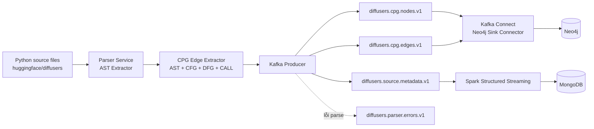

# Lab 04 — Incremental Code Property Graph Streaming Pipeline

> Pipeline phân tích mã nguồn Python của `huggingface/diffusers`, tạo Code Property Graph (CPG), phát sự kiện qua Apache Kafka và đồng bộ dữ liệu vào Neo4j cùng MongoDB theo cơ chế xử lý tăng dần.

## 1. Tổng quan

Pipeline nhận một file Python thuộc repository `huggingface/diffusers`, phân tích cấu trúc mã nguồn và tạo ba nhóm dữ liệu:

- **Node events**: các node AST như `Module`, `ClassDef`, `FunctionDef`, `Call`, `Assign`, ...
- **Edge events**: các quan hệ `AST_PARENT_OF`, `CFG_NEXT`, `DFG_DATA_DEPENDENCY` và `CALL`.
- **Metadata events**: thống kê file như kích thước, số dòng, số node, class, function, import, call và assignment.

Dữ liệu được gửi lên Kafka và chuyển đến hai nhánh xử lý:

1. Kafka Connect ghi node và edge vào **Neo4j**.
2. Spark Structured Streaming đọc metadata và ghi vào **MongoDB**.

## 2. Kiến trúc hệ thống



```text
Python source file
→ Parser Service
→ CPG Node/Edge Extraction
→ Kafka Producer
→ Kafka topics
├── Kafka Connect → Neo4j
└── Spark Structured Streaming → MongoDB
```

## 3. Chức năng chính

- Khám phá và phân tích file Python trong repository `diffusers`.
- Sinh ID ổn định bằng SHA-256 cho file, node và edge.
- Tạo `content_hash` để nhận biết nội dung file thay đổi.
- Tạo CPG gồm AST, CFG, DFG và quan hệ gọi hàm nội bộ.
- Phát node, edge, metadata và lỗi parse lên các Kafka topic riêng.
- Ghi node và edge vào Neo4j bằng cơ chế `MERGE`.
- Ghi metadata vào MongoDB bằng `_id = file_id`.
- Không tạo dữ liệu trùng khi replay cùng một file.
- Lưu Kafka offset bằng Spark checkpoint.
- Khởi động lại Spark mà không xử lý lại các offset cũ.

## 4. Công nghệ sử dụng

| Thành phần | Công nghệ |
|---|---|
| Ngôn ngữ | Python 3.11 |
| Message broker | Apache Kafka 4.1.2 |
| Streaming engine | Apache Spark 4.2.0 |
| Document database | MongoDB 8.0.26 |
| Graph database | Neo4j 5.26 |
| Kafka–Neo4j integration | Neo4j Kafka Connector 5.5.0 |
| Hạ tầng | Docker Desktop, Docker Compose |
| Báo cáo | Jupyter, Jupyter Book |

## 5. Kafka topics

| Topic | Dữ liệu |
|---|---|
| `diffusers.cpg.nodes.v1` | CPG node events |
| `diffusers.cpg.edges.v1` | CPG edge events |
| `diffusers.source.metadata.v1` | Metadata của file nguồn |
| `diffusers.parser.errors.v1` | Lỗi phát sinh khi parse |

Kafka Connect sử dụng thêm:

```text
lab04.connect.configs
lab04.connect.offsets
lab04.connect.status
```

## 6. Cấu trúc repository

```text
lab04-diffusers-cpg-streaming/
├── book/
├── checkpoints/
├── data/
│   ├── output/
│   └── repos/
│       └── diffusers/
├── docs/
├── infra/
│   ├── connect/
│   │   ├── plugins/
│   │   ├── connect-distributed.properties
│   │   └── docker-compose.yml
│   ├── neo4j/
│   │   ├── cleanup.cypher
│   │   ├── node-sink-connector.json
│   │   └── edge-sink-connector.json
│   └── docker-compose.yml
├── notebooks/
├── scripts/
│   ├── setup_kafka_topics.ps1
│   ├── run_spark_stream.ps1
│   ├── verify_mongodb.ps1
│   └── publish_metadata_sample.py
├── src/
│   ├── config.py
│   ├── parser/
│   ├── cpg/
│   ├── kafka/
│   └── streaming/
├── tests/
├── .env.example
├── compose.yaml
├── requirements.txt
└── README.md
```

## 7. Phân công nhiệm vụ

| Thành viên | Nhiệm vụ |
|---|---|
| Thành viên 1 | Repository, File Discovery và Parser Service |
| Thành viên 2 | CPG Edges và Apache Kafka |
| Thành viên 3 | Neo4j Graph Ingestion |
| Thành viên 4 | Spark Structured Streaming, MongoDB và Integration |

Điền họ tên và MSSV trước khi nộp.

## 8. Yêu cầu môi trường

- Git.
- Python 3.11.
- Docker Desktop.
- Docker Compose.
- PowerShell.
- Java 17 nếu chạy Spark trực tiếp ngoài Docker.

Kiểm tra:

```powershell
git --version
python --version
docker --version
docker compose version
```

## 9. Cài đặt dự án

### 9.1. Clone repository

```powershell
git clone https://github.com/vinhuytran0810-cell/lab04-diffusers-cpg-streaming.git
cd lab04-diffusers-cpg-streaming
```

Khi nhánh tích hợp chưa merge vào `main`:

```powershell
git checkout feature/spark-mongodb
git pull
```

### 9.2. Tạo virtual environment

```powershell
py -3.11 -m venv .venv
.\.venv\Scripts\Activate.ps1
python -m pip install --upgrade pip
pip install -r requirements.txt
```

### 9.3. Tạo `.env`

```powershell
Copy-Item .env.example .env
```

Nội dung đề xuất:

```dotenv
KAFKA_BOOTSTRAP_SERVERS=localhost:9092
KAFKA_NODE_TOPIC=diffusers.cpg.nodes.v1
KAFKA_EDGE_TOPIC=diffusers.cpg.edges.v1
KAFKA_METADATA_TOPIC=diffusers.source.metadata.v1
KAFKA_ERROR_TOPIC=diffusers.parser.errors.v1

NEO4J_URI=bolt://localhost:7687
NEO4J_USERNAME=neo4j
NEO4J_PASSWORD=CHANGE_TO_A_STRONG_LOCAL_PASSWORD

MONGODB_URI=mongodb://localhost:27017
MONGODB_DATABASE=bigdata_lab04
MONGODB_COLLECTION=source_metadata

DIFFUSERS_REPO_PATH=data/repos/diffusers
SPARK_CHECKPOINT_PATH=checkpoints/metadata_stream
```

Chỉ để **một** dòng `NEO4J_PASSWORD`. Không commit `.env`.

### 9.4. Clone repository cần phân tích

```powershell
New-Item data\repos -ItemType Directory -Force | Out-Null

git clone --depth 1 `
  https://github.com/huggingface/diffusers.git `
  data/repos/diffusers
```

## 10. Khởi động hạ tầng

Nên dùng hai terminal:

- **Terminal 1**: Spark Structured Streaming.
- **Terminal 2**: quản trị, producer và kiểm tra.

### 10.1. Kafka và MongoDB

```powershell
docker compose up -d
docker compose ps
```

Container chính:

```text
lab04-kafka
lab04-mongodb
```

### 10.2. Neo4j

Nạp mật khẩu từ `.env`:

```powershell
$neo4jPassword = (
    Get-Content .env |
    Where-Object { $_ -match '^NEO4J_PASSWORD=' }
) -replace '^NEO4J_PASSWORD=', ''

$neo4jPassword = $neo4jPassword.Trim()
$env:NEO4J_PASSWORD = $neo4jPassword
```

Khởi động:

```powershell
docker compose -f infra/docker-compose.yml up -d
```

Kiểm tra:

```powershell
docker exec lab04-neo4j `
  cypher-shell `
  -u neo4j `
  -p $neo4jPassword `
  "RETURN 1 AS ok;"
```

Neo4j Browser:

```text
http://localhost:7474
```

### 10.3. Tạo Kafka topics

```powershell
.\scripts\setup_kafka_topics.ps1
```

Kiểm tra:

```powershell
docker exec lab04-kafka `
  /opt/kafka/bin/kafka-topics.sh `
  --bootstrap-server localhost:9092 `
  --list
```

## 11. Kafka Connect và Neo4j Sink

### 11.1. Cài plugin

Tải file:

```text
neo4j-kafka-connect-5.5.0.jar
```

Đặt tại:

```text
infra/connect/plugins/neo4j-kafka-connect-5.5.0.jar
```

File `.jar` đã được `.gitignore` loại trừ.

### 11.2. Khởi động Kafka Connect

```powershell
docker compose -f infra/connect/docker-compose.yml up -d
```

Kiểm tra plugin:

```powershell
curl.exe http://localhost:8083/connector-plugins
```

Phải có:

```text
org.neo4j.connectors.kafka.sink.Neo4jConnector
```

### 11.3. Tạo constraint

```powershell
docker exec lab04-neo4j `
  cypher-shell `
  -u neo4j `
  -p $neo4jPassword `
  "CREATE CONSTRAINT cpg_node_id_unique IF NOT EXISTS
   FOR (n:CPGNode)
   REQUIRE n.id IS UNIQUE;"
```

### 11.4. Đăng ký hai sink connector

Các file JSON trên GitHub giữ mật khẩu là `CHANGE_ME`. Lệnh sau chỉ chèn mật khẩu trong bộ nhớ:

```powershell
function Set-Neo4jSinkConnector {
    param(
        [Parameter(Mandatory = $true)]
        [string]$ConfigPath
    )

    $payload = Get-Content $ConfigPath -Raw | ConvertFrom-Json
    $name = $payload.name
    $config = $payload.config

    $config.'neo4j.authentication.basic.password' = $neo4jPassword

    Invoke-RestMethod `
      -Method Put `
      -Uri "http://localhost:8083/connectors/$name/config" `
      -ContentType "application/json" `
      -Body ($config | ConvertTo-Json -Depth 20)
}

Set-Neo4jSinkConnector `
  -ConfigPath "infra/neo4j/node-sink-connector.json"

Set-Neo4jSinkConnector `
  -ConfigPath "infra/neo4j/edge-sink-connector.json"
```

Kiểm tra:

```powershell
curl.exe http://localhost:8083/connectors/diffusers-cpg-node-sink/status
curl.exe http://localhost:8083/connectors/diffusers-cpg-edge-sink/status
```

Connector và task phải có `"state": "RUNNING"`.

## 12. Chạy Parser Service độc lập

```powershell
python -m src.parser.parser_service `
  --repo-path data/repos/diffusers `
  --file src/diffusers/__init__.py `
  --output-dir data/output
```

Kết quả:

```text
data/output/src__diffusers____init__.nodes.jsonl
data/output/src__diffusers____init__.metadata.json
```

## 13. Chạy Spark Structured Streaming

Mở terminal riêng:

```powershell
.\scripts\run_spark_stream.ps1
```

Spark sẽ:

1. Đọc `diffusers.source.metadata.v1`.
2. Parse metadata JSON.
3. Dùng `file_id` làm MongoDB `_id`.
4. Ghi vào `bigdata_lab04.source_metadata`.
5. Lưu checkpoint tại `checkpoints/metadata_stream`.

Thông báo thành công:

```text
Spark Structured Streaming đã khởi động
Kafka: kafka:29092
Topic: diffusers.source.metadata.v1
MongoDB: bigdata_lab04.source_metadata
Checkpoint: /opt/project/checkpoints/metadata_stream
```

Dừng Spark từ terminal khác:

```powershell
docker stop lab04-spark-stream
```

## 14. Chạy end-to-end

Trong terminal thứ hai:

```powershell
python -m src.kafka.producer `
  --repo-path data/repos/diffusers `
  --file src/diffusers/__init__.py
```

Producer:

1. Lấy commit hash.
2. Tính `file_id` và `content_hash`.
3. Trích xuất node và edge.
4. Gửi node, edge và metadata lên Kafka.
5. Gửi error event nếu xử lý thất bại.

## 15. Kiểm tra MongoDB

```powershell
.\scripts\verify_mongodb.ps1 `
  -FileId "<FILE_ID>"
```

Kiểm tra thêm hash và offset:

```powershell
.\scripts\verify_mongodb.ps1 `
  -FileId "<FILE_ID>" `
  -ExpectedHash "<CONTENT_HASH>" `
  -ExpectedOffset <OFFSET>
```

Offset phụ thuộc vào môi trường hiện tại.

Truy vấn trực tiếp:

```powershell
docker exec lab04-mongodb `
  mongosh `
  --quiet `
  --eval "db.getSiblingDB('bigdata_lab04').source_metadata.find().pretty()"
```

## 16. Kiểm tra Neo4j

```powershell
docker exec lab04-neo4j `
  cypher-shell `
  -u neo4j `
  -p $neo4jPassword `
  "MATCH (n:CPGNode)
   WHERE n.file_id = '<FILE_ID>'
   WITH count(n) AS node_count
   OPTIONAL MATCH ()-[r]->()
   WHERE r.file_id = '<FILE_ID>'
   RETURN node_count, count(r) AS edge_count;"
```

Node trùng:

```cypher
MATCH (n:CPGNode)
WHERE n.file_id = '<FILE_ID>'
WITH n.id AS id, count(*) AS total
WHERE total > 1
RETURN id, total;
```

Edge trùng:

```cypher
MATCH ()-[r]->()
WHERE r.file_id = '<FILE_ID>'
WITH r.id AS id, count(*) AS total
WHERE total > 1
RETURN id, total;
```

Hai truy vấn duplicate phải trả về `0` dòng.

## 17. Replay và idempotency

### 17.1. File không thay đổi

Chạy lại producer với cùng file:

```powershell
python -m src.kafka.producer `
  --repo-path data/repos/diffusers `
  --file src/diffusers/__init__.py
```

Kết quả mong đợi:

- MongoDB vẫn đúng một document.
- MongoDB offset tăng.
- Neo4j giữ nguyên số node và edge.
- Không có ID trùng.

### 17.2. File thay đổi

Sao lưu:

```powershell
Copy-Item `
  data\repos\diffusers\src\diffusers\__init__.py `
  data\repos\diffusers\src\diffusers\__init__.py.lab04-backup `
  -Force
```

Thêm hàm kiểm thử:

```powershell
Add-Content `
  data\repos\diffusers\src\diffusers\__init__.py `
  -Value @(
    "",
    "",
    "def lab04_replay_marker() -> str:",
    '    """Marker function used for Task 6 replay verification."""',
    '    return "version-2"'
  )
```

Xóa snapshot Neo4j cũ:

```powershell
docker exec lab04-neo4j `
  cypher-shell `
  -u neo4j `
  -p $neo4jPassword `
  "MATCH (n:CPGNode)
   WHERE n.file_id = '<FILE_ID>'
   DETACH DELETE n;"
```

Chạy producer lại và kiểm tra:

- `file_id` không đổi.
- `content_hash` thay đổi.
- Số node/edge thay đổi.
- `function_count` tăng.
- MongoDB vẫn chỉ có một document.
- Replay snapshot mới không tạo trùng.

Khôi phục file:

```powershell
Copy-Item `
  data\repos\diffusers\src\diffusers\__init__.py.lab04-backup `
  data\repos\diffusers\src\diffusers\__init__.py `
  -Force
```

## 18. Kiểm thử Spark checkpoint

1. Ghi nhận offset hiện tại.
2. Dừng Spark.
3. Khởi động lại bằng cùng script.
4. Không chạy producer.
5. Kiểm tra offset không đổi.

```powershell
docker stop lab04-spark-stream
.\scripts\run_spark_stream.ps1
```

Kiểm tra:

```powershell
.\scripts\verify_mongodb.ps1 `
  -FileId "<FILE_ID>" `
  -ExpectedHash "<CONTENT_HASH>" `
  -ExpectedOffset <OFFSET_TRƯỚC_KHI_RESTART>
```

## 19. Kết quả tích hợp đã kiểm thử

File kiểm thử:

```text
src/diffusers/__init__.py
```

### Baseline

| Chỉ số | Kết quả |
|---|---:|
| MongoDB documents theo `file_id` | 1 |
| CPG nodes | 2871 |
| CPG edges | 4564 |
| Function count | 0 |
| Replay tạo dữ liệu trùng | Không |

### Sau khi thêm hàm thử

| Chỉ số | Kết quả |
|---|---:|
| MongoDB documents theo `file_id` | 1 |
| CPG nodes | 2879 |
| CPG edges | 4578 |
| Function count | 1 |
| Replay tạo dữ liệu trùng | Không |
| Restart Spark xử lý lại offset cũ | Không |

Số lượng có thể thay đổi nếu clone `diffusers` tại commit khác.

## 20. Theo dõi hệ thống

```powershell
docker ps
docker logs lab04-kafka-connect --tail 100
docker logs lab04-neo4j --tail 100
```

Connector status:

```powershell
curl.exe http://localhost:8083/connectors/diffusers-cpg-node-sink/status
curl.exe http://localhost:8083/connectors/diffusers-cpg-edge-sink/status
```

Consumer groups:

```powershell
docker exec lab04-kafka `
  /opt/kafka/bin/kafka-consumer-groups.sh `
  --bootstrap-server localhost:9092 `
  --all-groups `
  --describe
```

## 21. Dừng hệ thống

```powershell
docker stop lab04-spark-stream
docker compose -f infra/connect/docker-compose.yml down
docker compose -f infra/docker-compose.yml down
docker compose down
```

Không thêm `-v` nếu không muốn xóa volume database.

## 22. Troubleshooting

### Neo4j authentication failure

Biến `$neo4jPassword` chỉ tồn tại trong terminal đã khai báo. Nạp lại từ `.env` ở terminal mới.

### Kafka Connect không thấy plugin

Kiểm tra:

```powershell
Get-ChildItem infra\connect\plugins
```

Sau đó tạo lại container:

```powershell
docker compose -f infra/connect/docker-compose.yml down
docker compose -f infra/connect/docker-compose.yml up -d
```

### Connector FAILED

```powershell
curl.exe http://localhost:8083/connectors/diffusers-cpg-node-sink/status
curl.exe http://localhost:8083/connectors/diffusers-cpg-edge-sink/status
docker logs lab04-kafka-connect --tail 200
```

### Neo4j không in `0, 0`

Dùng `OPTIONAL MATCH` cho relationship. `MATCH ()-[r]->()` không trả dòng khi không có relationship.

### Spark không tìm thấy Docker network

```powershell
docker compose up -d
docker network ls |
  Select-String "lab04-diffusers-cpg-streaming_default"
```

### Cảnh báo orphan containers

Không dùng `--remove-orphans`, vì nhiều file Compose đang dùng chung project name.

## 23. Bảo mật và Git

Không commit:

```text
.env
infra/connect/plugins/*.jar
data/repos/
data/output/
checkpoints/
```

Hai connector JSON phải giữ:

```json
"neo4j.authentication.basic.password": "CHANGE_ME"
```

Kiểm tra:

```powershell
git status --short
git diff --cached --check
git check-ignore -v `
  infra\connect\plugins\neo4j-kafka-connect-5.5.0.jar
```

## 24. Kiểm thử Python

```powershell
pytest
```

Kiểm tra cú pháp:

```powershell
python -m py_compile `
  src/config.py `
  src/cpg/edge_extractor.py `
  src/kafka/producer.py `
  src/kafka/schemas.py `
  src/streaming/metadata_to_mongodb.py
```

## 25. Minh chứng báo cáo

Jupyter Book/báo cáo cuối nên có:

- Kiến trúc tổng thể.
- Schema node, edge, metadata và error.
- Kafka topics.
- Kafka Connect `RUNNING`.
- Neo4j node/edge queries.
- MongoDB document.
- Baseline và phiên bản đã sửa.
- Replay không trùng.
- Restart Spark với checkpoint.
- Nhận xét và hạn chế.

## 26. Trạng thái hoàn thành

- [x] Repository discovery.
- [x] Parser Service.
- [x] AST node extraction.
- [x] CPG edge extraction.
- [x] Kafka topics và producer.
- [x] Neo4j Kafka Connect sinks.
- [x] Spark Structured Streaming.
- [x] MongoDB sink.
- [x] End-to-end integration.
- [x] Replay/idempotency verification.
- [x] Spark checkpoint verification.
- [ ] Hoàn thiện Jupyter Book và ảnh minh chứng cuối.
- [ ] Merge nhánh tích hợp vào `main`.

---

**Upstream repository:** `huggingface/diffusers`  
**Source scope:** `src/diffusers/**/*.py`
